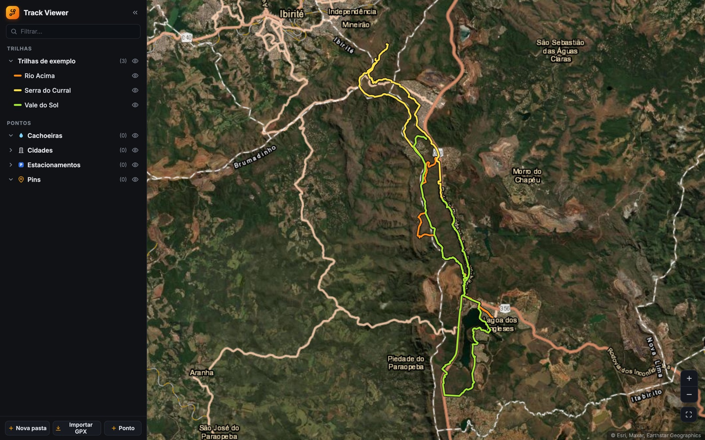

# Track Viewer

A focused GPX viewer for planning bike trips — bulk-import hundreds of tracks onto satellite imagery, organise them in a folder tree, mark points of interest. Nothing else.

**[▶ Live demo](https://somacavalieri.github.io/track-viewer/)** · **[Product spec (PT-BR)](docs/PRD.md)** · React · TypeScript · MapLibre GL · Postgres



## The problem

The best web tool for looking at trails is Google Earth, and it fails at three things for this use:

- **Bloated** — a 3D globe, layers, and a timeline get in the way of "show me these lines on satellite imagery".
- **Won't open GPX** — it takes KML only, so every file needs converting first.
- **Bad at bulk** — organising dozens of files into folders is manual work, one at a time.

I ride, I collect GPX files from Wikiloc, Strava and friends, and I had accumulated hundreds of them. I wanted the 10% of Google Earth I actually use.

## What it does

- **Bulk import** — drop a whole folder of `.gpx` at once. Parsing, distance, elevation gain and de-duplication by file hash all happen in the browser; a bad file doesn't abort the batch.
- **Folder tree** — unlimited nesting, with a visibility toggle per folder that cascades to everything inside it.
- **Satellite basemap** — Esri World Imagery with a labels layer on top, tracks drawn as GPU-rendered lines that stay legible over imagery.
- **Points of interest** — four categories, created by clicking the map or by typing coordinates (decimal or degrees/minutes/seconds).
- **Optional sync** — configure a Postgres backend and the same library follows you across devices. Without it the app is fully local.

## Try it

The [live demo](https://somacavalieri.github.io/track-viewer/) runs **entirely in your browser** — no account, no server, nothing leaves your machine. Three sample tracks load on the first visit; drag your own `.gpx` files onto the window to add more.

Two things to know: the interface is in **Portuguese**, and the demo intentionally ships without backend credentials, so the sign-in screen never appears and everything is stored in IndexedDB.

## Design decisions

The reasoning behind the build, in the order it mattered.

**A static SPA talking straight to Postgres — no backend of my own.**
Parsing, simplification and hashing all run in the browser; the database is reached over PostgREST with row-level security, and auth is delegated. There is no server to deploy, patch, or pay for. The trade is that every byte of logic ships to the client and the data API's contract is outside my control — which is why all remote access sits behind one module that can be swapped.

**MapLibre GL instead of Leaflet.**
The requirement was hundreds of visible tracks staying fluid on a tablet. Leaflet draws to SVG/Canvas on the CPU and degrades with feature count; MapLibre renders on the GPU. This decision was made from the performance requirement, not from familiarity.

**Neon instead of Supabase — a reversal, and why.**
Supabase was the original choice and is still the better-documented path: one service for Postgres, auth *and* blob storage, with far more prior art for the "static SPA + RLS" pattern. I switched to Neon for reasons specific to me — my other projects already live there, and Supabase's free tier pauses a project after a week of inactivity while Neon's compute merely sleeps and wakes in about a second. Since this is a single-user tool, the data is small enough that the original GPX files can live compressed inside Postgres and the separate storage service stops being an advantage. Both are Postgres with RLS, so the migration back is open. [The spec records the losing option's merits](docs/PRD.md#6-stack-e-arquitetura) rather than deleting them.

**Esri imagery instead of Google.**
No API key, no billing account, no SDK lock-in. Swapping providers is a one-line change to a tile URL — which is the actual mitigation for the risk that a free tile policy changes.

**Simplified geometry for rendering, original files kept forever.**
Tracks are simplified with Douglas–Peucker down to 1–3k points for drawing, but the untouched GPX is stored alongside. Rendering is a derived artifact; the user's data is not. A viewer that quietly degrades what you import is a viewer you can't trust.

**What I deliberately did not build.**
No route drawing or editing, no turn-by-turn navigation, no offline mode, no multi-user or social features. Each one was considered and cut — the spec lists them as explicit non-goals so the scope couldn't drift into them later.

## Architecture

```
browser                                    ┌─ Esri World Imagery (tiles)
├─ parse GPX ····· @tmcw/togeojson         │
├─ simplify ······ Douglas–Peucker         │
├─ de-dupe ······· SHA-256 (crypto.subtle) │
├─ render ········ MapLibre GL ────────────┘
├─ state ········· Zustand
└─ cache ········· IndexedDB ──── local-first: the app is fully usable here
                        │
                        └── optional ──▶ Neon Postgres
                                         · Data API (PostgREST) + row-level security
                                         · Neon Auth (email/password, sign-up disabled)
```

Metadata loads on startup; track geometry is fetched lazily in batches and cached in IndexedDB — since a track's geometry never changes after import, that cache needs no invalidation. If the remote is unreachable the app keeps working locally instead of failing.

~3,500 lines of TypeScript. [`src/store.ts`](src/store.ts) holds the state and all mutations, [`src/remote.ts`](src/remote.ts) isolates every call to the data API, [`src/components/MapView.tsx`](src/components/MapView.tsx) owns the map.

## What I'd do next

Being straight about where this stands:

- **No automated tests.** The riskiest logic — GPX parsing, elevation-gain smoothing, the folder visibility cascade — is pure and easy to test. That's the first thing I'd add if others were going to work on this.
- **The bundle isn't code-split** — 504 KB gzipped, most of it MapLibre in a single chunk. Fine for a tool I open daily on a warm cache, wrong for a first visit on mobile data.
- **Photos attached to points stay local.** Syncing them needs object storage, which is post-MVP.
- **The Neon Data API is beta.** Documented as a risk with a fallback: local mode keeps working if the contract shifts.

Next features, in priority order: place search, GPX/KML export, a topographic basemap toggle, and elevation profiles in the track panel.

## Running it

```bash
npm install
npm run dev      # http://localhost:5183/track-viewer/
```

Sync is off unless you supply credentials — copy `.env.example` to `.env.local` and fill it in, then run [`db/schema.sql`](db/schema.sql) against your database. Without it the app runs fully local, which is exactly what the demo does.

## About this project

I wrote [the spec](docs/PRD.md) first — problem, non-goals, numbered requirements, acceptance criteria, a risk table and a decision log — and then built it. The spec is in Portuguese and is the more interesting half of this repository: it's where the trade-offs are argued, including the ones I got wrong the first time.

MIT licensed. Built by [Soma Cavalieri](https://github.com/somacavalieri).
